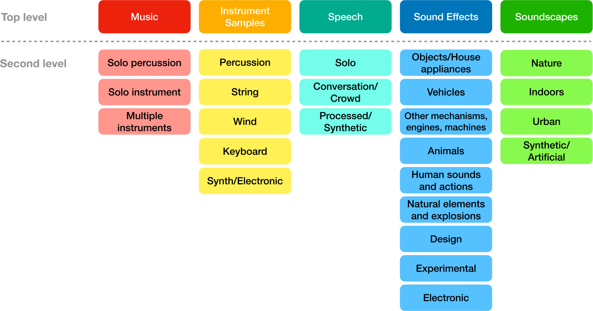

# A Simple and Broad Taxonomy 
This repository contains information about a simple taxonomy for the classification of a broad range of sounds, suitable for large and diverse libraries.
This taxonomy enables the organization of sounds into a hierarchical structure consisting of two levels, including a total of 29 sound classes.
There are 5 top-level categories representing broad classes, and a second level with 24 total categories hat capture more nuanced distinctions within each class.

<!--  -->

## Additional data
In this [file](taxonomy_description.ods) we present the taxonomy by giving a brief description and examples for every subclass.

In this [file](taxonmy_design_criteria_scores.ods) you can find the scores for the design criteria which we computed during the taxonomy creation.

## License
[GNU General Public License v3.0](LICENSE)